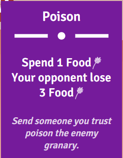

## **城堡决斗游戏**

### (一)游戏规则

```
1. 两名玩家轮流出牌；
2. 游戏开始时每位玩家有10点生命值，10分食物和5张手牌；
3. 玩家最高生命值为10点，食物最多为5点；
4. 当玩家的食物或生命值为0时就失败了；
5. 两名玩家都可能在平局中失败；
6. 每个回合中，玩家能做的操作就是打出一张牌，将其放到弃牌堆中；
7. 在每回合开始，玩家从抽牌堆中摸一张牌（第一回合除外）；
8. 根据前面两条规则，玩家在每个回合开始的时候都有5张牌；
9. 当玩家摸牌时，如果抽牌堆空了，将会把弃牌堆中的牌重新放进抽牌堆；
10. 卡牌可以改变玩家自己或对手的生命值和食物点数；
11. 有些卡牌还可以让玩家跳过当前回合；
```

### (二)项目设置

```
game
	assert
		css
			style.css	 	CSS文件
			transition.css  vue的缓动样式
		js
			cards.js		所有卡牌的数据(Vue势力中的data里的数据)
			main.js			Vue实例在这里面创建
			state.js		游戏的主要数据属性
			utils.js		 一些有用工具方法
			vue.js
		
	components
		ui.js		ui组件
		world.js	世界的组件
	
	svg			 包含游戏中所有的SVG图像

	raw			 城堡的图片

	index.html   Web页面
```

### (三)项目组件

#### ui.js中的组件

##### 1. 顶部组件


```vue
Vue.component('top-bar', {
    template: `<div class="top-bar" :class="'player-' + currentPlayerIndex">
                    <div class="player p0">{{ players[0].name }}</div>
                    <div class="turn-counter">
                        
                        <div class="turn">Turn {{ turn }}</div>
                    </div>
                    <div class="player p1">{{ players[1].name }}</div>
                </div>`,
    props: ['players', 'currentPlayerIndex', 'turn'],
    created () {
        // console.log(this.players, this.currentPlayerIndex, this.turn)
    },
});
```

##### 2. 卡牌组件



```vue
Vue.component('card', {
    template: `<div class="card" :class="'type-' + def.type" @click="play">
                    <div class="title">{{ def.title }}</div>
                    
                    <div class="description"><div v-html="def.description"></div></div>
                    <div class="note" v-if="def.note"><div v-html="def.note"></div></div>
                </div>`,
    props: ['def'],
    methods: {
        play () {
            this.$emit('play')
        },
    },
});
```

##### 3. 手牌组件


```vue
Vue.component('hand', {
    template: `<div class="hand">
                    <div class="wrapper">
                        <transition-group name="card" tag="div" class="cards" @after-leave="handleLeaveTransitionEnd">
                            <card v-for="card of cards" :key="card.uid" :def="card.def" @play="handlePlay(card)" />
                        </transition-group>
                    </div>     
               </div>`,
    props: ['cards'],
    methods: {
        handlePlay(card) {
            this.$emit('card-play', card);
        },
        handleLeaveTransitionEnd () {
            this.$emit('card-leave-end')
        },
    }
});
```

##### 4. 遮盖层

```vue
// main.js
<transition name="zoom">
   <overlay v-if="activeOverlay" :key="activeOverlay" @close="handleOverlayClose">
      // 如果是overlay-content-game-over,则将遮盖层overlay-content-game-over渲染到这里
      <component :is="'overlay-content-' + activeOverlay" :player="currentPlayer" :opponent="currentOpponent" :players="players" />
   </overlay>
</transition>
```

###### 1. overlay-content-player-turn遮盖层(轮到谁的回合就显示谁的信息)


```vue
Vue.component('overlay-content-player-turn', {
   template: `<div>
                    <div class="big" v-if="player.skipTurn">{{ player.name }},<br>your turn is skipped</div>
                    <div class="big" v-else>{{ player.name }},<br>your turn has come!</div>
                    <div>Tap to continue</div>
              </div>`,
   props: ['player'],
});
```

###### 2. overlay-content-last-play遮盖层(上回合对手出的牌)


```vue
Vue.component('overlay-content-last-play', {
    template: `<div>
                    <div v-if="opponent.skippedTurn">{{ opponent.name }} turn was skipped!</div>
                    <template v-else>
                        <div>{{ opponent.name }} just played:</div>
                        <card :def="lastPlayedCard" />
                    </template>
               </div>`,
    props: ['opponent'],
    computed: {
        lastPlayedCard() {
            return getLastPlayedCard(this.opponent);
        }
    }
});
```

###### 3. 游戏结束时显示的遮盖层


```vue
// ui.js
Vue.component('overlay-content-game-over', {
   template: `<div>
                   <div class="big">Game Over</div>
                   <player-result v-for="player in players" :player="player" />
              </div>`,
   props: ['players']
});

Vue.component('player-result', {
    template: `<div class="player-result" :class="result">
                    <span class="name">{{ player.name }}</span> is
                    <span class="result">{{ result }}</span>
               </div>`,
    props: ['player'],
    computed: {
        result () {
            return this.player.dead ? 'defeated' : 'victorious'
        },
    },
});
```

#### world.js中的组件

###### 1. castle-banner + bubble + banner-bar


```vue
Vue.component('castle-banners', {
    template: `<div class="banners">
                    <!-- 食物 -->
                    <!--图标-->
                    
                    <!--显示还剩下多少的小气泡-->
                    <bubble type="food" :value="player.food" :ratio="foodRatio" />
                    <!--食物条-->
                    <banner-bar class="food-bar" color="#288339" :ratio="foodRatio" />

                    <!-- 生命 -->
                    <!--图标-->
                    
                     <!--显示还剩下多少的小气泡-->
                    <bubble type="health" :value="player.health" :ratio="healthRatio" />
                    <!--生命条-->
                    <banner-bar class="health-bar" color="#9b2e2e" :ratio="healthRatio" />
               </div>`,
    props: ['player'],
    computed: {
        foodRatio () {
            return this.player.food / maxFood;
        },
        healthRatio () {
            return this.player.health / maxHealth;
        },
    }
});

Vue.component('bubble', {
    template: `<div class="stat-bubble" :class="type + '-bubble'" :style="bubbleStyle">
                    
                    <div class="counter">{{ value }}</div>
               </div>`,
    props: ['type', 'value', 'ratio'],
    computed: {
        bubbleStyle () {
            return {
                top: (this.ratio * 220 + 40) * state.worldRatio + 'px',
            }
        },
    },
});

Vue.component('banner-bar', {
   template: '#banner',
   props: ['color', 'ratio'],
   computed: {
       targetHeight() {
           return 220 * this.ratio + 40;
       },
   },
   data() {
       return {
           height: 0,
       }
   },
   watch: {
       targetHeight (newValue, oldValue) {
           const vm = this;
           new TWEEN.Tween({ value: oldValue })
               .easing(TWEEN.Easing.Cubic.InOut)
               .to({ value: newValue }, 500)
               .onUpdate(function () {
                   vm.height = this.value.toFixed(0)
               })
               .start();
       },
   },
   created() {
       this.height = this.targetHeight;
   }
});
```

###### 2. 城堡组件


```vue
Vue.component('castle', {
    template: `<div class="castle" :class="'player-' + index">
                   
                   
                   <castle-banners :player="player" />
               </div>`,
    props: ['player', 'index'],
});
```

###### 3. 移动的云层(用了Tween.js)

```vue
const cloudAnimationDurations = {
    min: 10000,
    max: 50000,
};

Vue.component('cloud', {
   template: `<div class="cloud" :class="'cloud-' + type" :style="style">
                  
              </div>`,
   props: ['type'],
   data() {
       return {
           style: {
               transform: 'none',
               zIndex: 0,
           }
       }
   },
   methods: {
       initPosition () {
           const width = this.$el.clientWidth;
           this.setPosition(-width, 0);
       },
       setPosition (left, top) {
           this.style.transform = `translate(${left}px, ${top}px)`
       },
       startAnimation (delay = 0) {
           const vm = this;

           const width = this.$el.clientWidth;

           const { min, max } = cloudAnimationDurations;
           const animationDuration = Math.random() * (max - min) + min;

           this.style.zIndex = Math.round(max - animationDuration);

           const top = Math.random() * (window.innerHeight * 0.3);

           new TWEEN.Tween({ value: -width })
               .to({ value: window.innerWidth }, animationDuration)
               .delay(delay)
               .onUpdate(function () {
                   vm.setPosition(this.value, top);
               })
               .onComplete(() => {
                   // With a random delay
                   this.startAnimation(Math.random() * 10000);
               })
               .start()
       },
   },
   mounted () {
       this.startAnimation(-Math.random() * cloudAnimationDurations.min)
   },
});
```

注意：

```js
// Tween.js, 需要我们手动开启，代码如下(在main.js中)
requestAnimationFrame(animate);

function animate(time) {
    requestAnimationFrame(animate);
    TWEEN.update(time);
}
```

